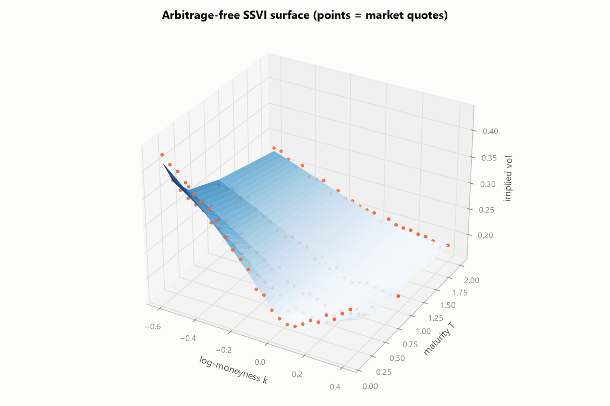
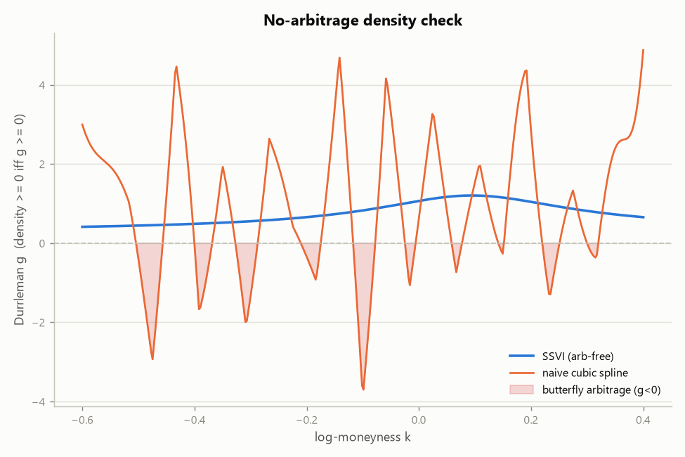
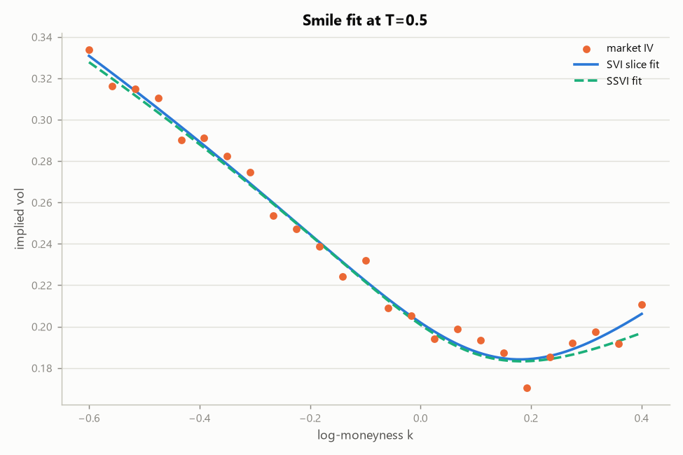
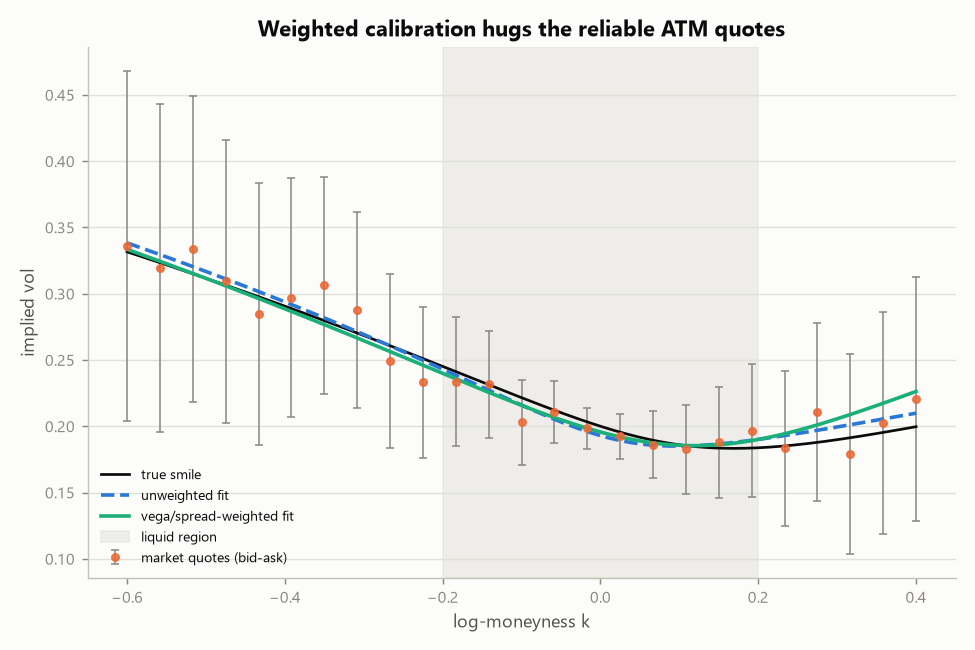
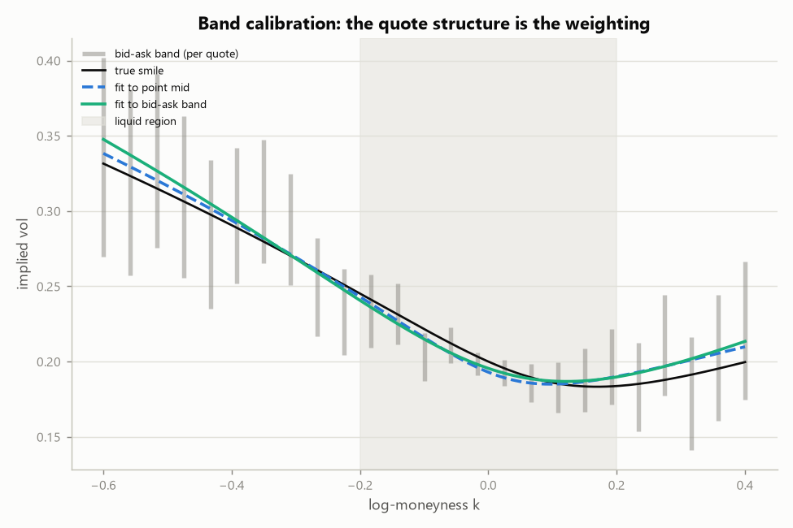
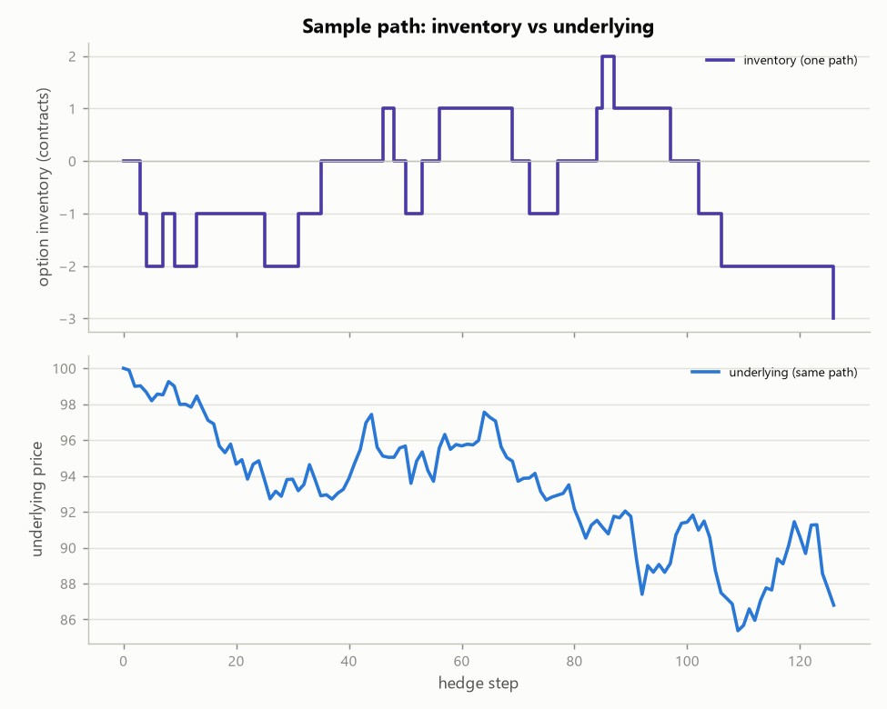

# Charts

Every figure the toolkit generates, in one place. Regenerate with:

```bash
python market_making/mm_sim.py                   # -> charts/market_making/
python market_making/glft.py                     # -> charts/market_making/glft_quotes.png
python pricing_and_vol_surface/vol_surface.py    # -> charts/vol_surface/
```

All charts share the repo's colorblind-validated style (`plotstyle.py`).

## Vol surface (`pricing_and_vol_surface/vol_surface.py`)

Write-up: [`pricing_and_vol_surface/VOL_SURFACE.md`](../pricing_and_vol_surface/VOL_SURFACE.md)

**SSVI surface** — the fitted arbitrage-free surface.


**Density check** — Durrleman `g(k) >= 0`: a naive spline admits butterfly
arbitrage (negative density) that the SSVI fit provably removes.


**Slice fit** — per-expiry SVI against market quotes.


**Weighted calibration** — vega/liquidity weights keep noisy illiquid wings
from dragging the fit off the reliable ATM quotes.


**Band fit** — calibrating to the bid-ask interval instead of a point mid.


## Market making (`market_making/mm_sim.py`, `glft.py`)

Write-up: [`market_making/README.md`](../market_making/README.md)

**Hedging validation (Experiment A)** — simulated delta-hedged P&L matches
the closed-form gamma-P&L identity.


**P&L vs realised vol (Experiment B)** — spread capture is flat, vol P&L
slopes down through implied; the spread must pay for inventory vol risk.


**Sample inventory path** — one book, mean-reverted by the skew.


**Adverse selection (Experiment C)** — directional toxicity costs through
hedge latency; a wider spread buys tolerance.


**Vol-informed flow (Experiment D)** — vega toxicity survives instant
hedging; the defence is a vol-space markup with an interior optimum.


**Online toxicity estimation (Experiment E)** — the desk infers directional
toxicity from its own fill markouts and widens adaptively.


**Online vol-toxicity estimation (Experiment F)** — the vega-space markout
detects vol-informed flow and prices the markup on the excess over its null.


**GLFT quotes** — exact finite-horizon quotes fading to c0 near the terminal
time and converging to the stationary quotes; the closed form's
constant-spread + linear-skew claim against the exact answer.


**GLFT vs hand-tuned quoting (Experiment G)** — inventory control is worth
~4 CE points over none under uncertain realised vol; one derived dial spans
the mean-risk frontier.


**Hawkes clustered flow (Experiment H)** — volume-matched self-exciting flow
raises inventory risk, and the hand-tuned-vs-derived desk ranking flips when
the independence assumption fails.

