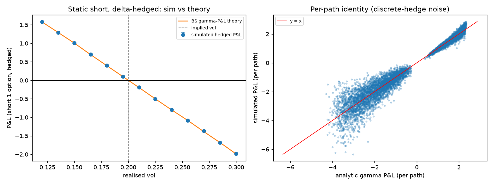
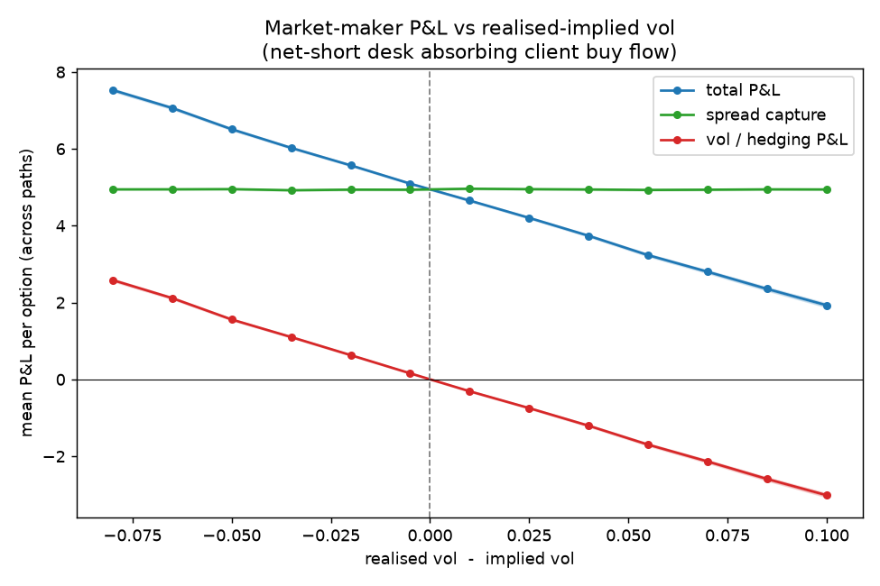

# Options market-making simulator

A delta-hedged options market-maker on a single European option, built to show
the two P&L engines a real options desk runs on and how they trade off against
each other. Run it:

```bash
python market_making/mm_sim.py          # prints the tables, writes figures/
python -m pytest tests/test_mm.py -q    # verifies the engine (see below)
```

## The idea

An options market-maker earns money two ways, and they pull in different
directions:

1. **Spread capture.** It quotes a two-sided market around the theoretical
   value and earns the edge (half-spread, adjusted for inventory skew) every
   time incoming flow crosses its quote. This depends on *volume*, not on where
   volatility lands.
2. **Vol / hedging P&L.** Whatever net options position the flow leaves it
   holding, it delta-hedges. Delta-hedging strips out the direction of the
   underlying but leaves a **gamma** exposure whose P&L is set by the gap
   between the volatility it *quoted* (implied) and the volatility the
   underlying actually *realises*. A net-short desk makes money when the market
   is calmer than it priced and loses when it is wilder.

The desk's job is to set a spread wide enough that engine (1) pays for the risk
it takes on in engine (2).

## The model

* **Underlying:** GBM with a *realised* vol `sigma_real` (the "true" world).
* **Fair value:** Black-Scholes at the desk's *implied* vol `sigma_impl` — the
  vol it quotes, marks, and hedges at.
* **Quoting:** an [Avellaneda-Stoikov](https://www.math.nyu.edu/~avellane/HighFrequencyTrading.pdf)-style
  arrival intensity `lambda = A * exp(-k * d)`, where `d` is the quote's
  distance from fair. Inventory is controlled by skewing the reservation price
  `theo - skew * inventory`, which tightens the side that reduces inventory and
  widens the side that grows it.
* **Client flow:** a `flow_imbalance` parameter makes clients net buyers (they
  lift the desk's offers), so the desk accumulates a **net short** book — the
  realistic case where an MM absorbs one-sided demand.
* **Hedging:** delta-hedged every step at the *implied-vol* delta (standard
  "hedge at the vol you marked at"). All cash flows — option fills, hedge
  trades, expiry settlement — run through a single cash account, so terminal
  cash *is* the P&L.
* `r` is defaulted to 0 in the experiments to isolate the vol P&L from
  financing/discounting; it is a supported parameter throughout.

## Is it correct? (Experiment A)

Hedging at implied vol, a short option held to expiry has a known closed-form
P&L — the gamma-P&L identity:

```
PnL  ≈  0.5 * integral[ Gamma_impl(t) * S(t)^2 * (sigma_impl^2 - sigma_real^2) ] dt
```

Experiment A runs a static short option through the hedger and compares the
simulated P&L to that integral. They match to Monte-Carlo error across the whole
vol range, and the P&L crosses zero exactly at `sigma_real = sigma_impl`:



Left: simulated mean P&L (points) sits on the theoretical curve (line). Right:
per path, simulated P&L tracks the analytic gamma-P&L along `y = x`, with the
scatter being the discrete-hedging error that vanishes as the hedge frequency
rises. This is what makes the vol P&L in the full simulator trustworthy rather
than merely plausible. `tests/test_mm.py::test_hedging_identity` enforces it.

## The result (Experiment B)

The full market-maker — two-sided quoting, inventory skew, client buy-flow
imbalance, delta-hedged — swept across realised vol:



* **Spread capture (green)** is flat — the desk earns its edge on volume
  regardless of where vol lands.
* **Vol / hedging P&L (red)** slopes down through zero at implied vol: the
  net-short book profits when the world is calm and bleeds gamma when it is
  wild.
* **Total (blue)** is their sum. At the implied vol the desk quoted, it keeps
  roughly the full spread; as realised vol runs above implied, the gamma losses
  eat into and eventually overwhelm the spread.

The lesson, and the reason a market-maker's spread is not arbitrary: **the
spread has to be wide enough to pay for the vol risk of the inventory the flow
forces onto the book.** A representative inventory path (net short, mean-reverted
by the skew) is in `figures/sample_inventory_path.png`.

## Talking points

* Delta-hedging removes direction and leaves a gamma / vega bet on realised vs
  implied vol — demonstrated, not just asserted.
* Inventory skew is a control loop: it prices the desk's own risk into its
  quotes to mean-revert the book toward flat.
* Spread width is a risk decision, not a preference — it is the premium charged
  for warehousing gamma against one-sided flow.

## Limitations and next steps

* One option, constant implied vol, Gaussian GBM — no vol surface, no jumps, no
  stochastic vol, so no vanna/volga or skew dynamics.
* Order flow is exogenous and uninformed; a real book faces adverse selection
  (informed flow that predicts the next move). Adding a signal-driven toxic-flow
  component is the most valuable extension.
* Hedging is calendar-based; a band / cost-aware hedging policy would trade off
  hedge error against transaction cost.
* Pricing is a vectorised closed-form BS for Monte-Carlo speed; the repo's
  autodiff pricer is `pricing_and_vol_surface/black.py`, and
  `tests/test_mm.py::test_cross_check_black_py` ties the two together.
