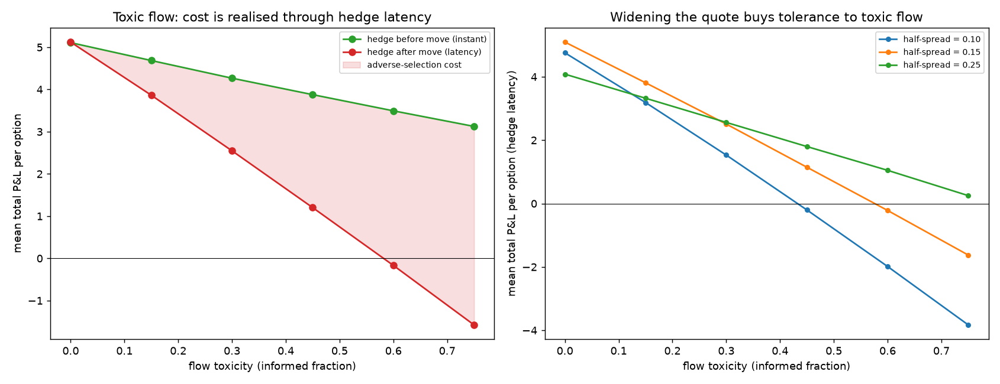
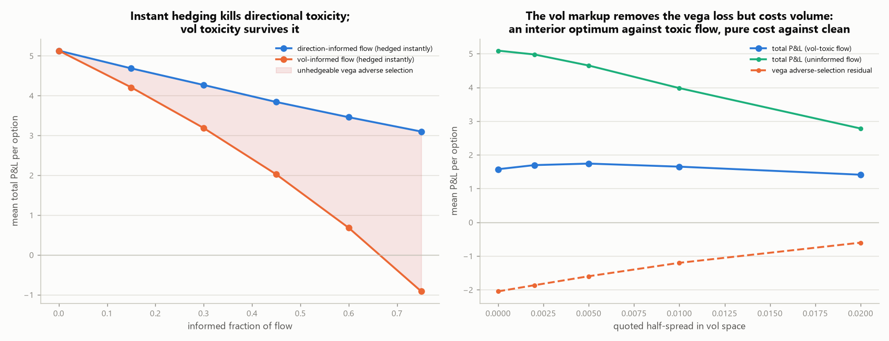
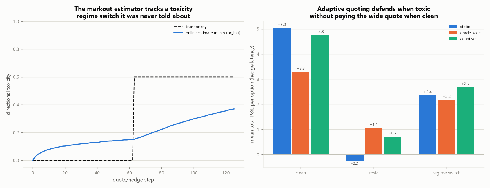
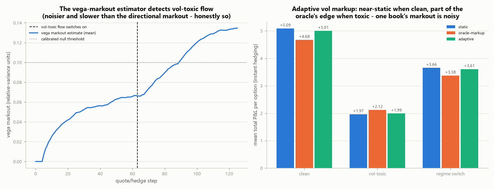

# Options market-making simulator

A delta-hedged options market-maker on a single European option, built to show
the two P&L engines a real options desk runs on and how they trade off against
each other. Run it:

```bash
python market_making/mm_sim.py          # prints the tables, writes figures/
python -m pytest tests/test_mm.py -q    # verifies the engine (see below)
```

## The idea

An options market-maker earns money two ways, and they pull in different
directions:

1. **Spread capture.** It quotes a two-sided market around the theoretical
   value and earns the edge (half-spread, adjusted for inventory skew) every
   time incoming flow crosses its quote. This depends on *volume*, not on where
   volatility lands.
2. **Vol / hedging P&L.** Whatever net options position the flow leaves it
   holding, it delta-hedges. Delta-hedging strips out the direction of the
   underlying but leaves a **gamma** exposure whose P&L is set by the gap
   between the volatility it *quoted* (implied) and the volatility the
   underlying actually *realises*. A net-short desk makes money when the market
   is calmer than it priced and loses when it is wilder.

The desk's job is to set a spread wide enough that engine (1) pays for the risk
it takes on in engine (2).

## The model

* **Underlying:** GBM with a *realised* vol `sigma_real` (the "true" world).
* **Fair value:** Black-Scholes at the desk's *implied* vol `sigma_impl` — the
  vol it quotes, marks, and hedges at.
* **Quoting:** an [Avellaneda-Stoikov](https://www.math.nyu.edu/~avellane/HighFrequencyTrading.pdf)-style
  arrival intensity `lambda = A * exp(-k * d)`, where `d` is the quote's
  distance from fair. Inventory is controlled by skewing the reservation price
  `theo - skew * inventory`, which tightens the side that reduces inventory and
  widens the side that grows it.
* **Client flow:** a `flow_imbalance` parameter makes clients net buyers (they
  lift the desk's offers), so the desk accumulates a **net short** book — the
  realistic case where an MM absorbs one-sided demand.
* **Hedging:** delta-hedged every step at the *implied-vol* delta (standard
  "hedge at the vol you marked at"). All cash flows — option fills, hedge
  trades, expiry settlement — run through a single cash account, so terminal
  cash *is* the P&L.
* `r` is defaulted to 0 in the experiments to isolate the vol P&L from
  financing/discounting; it is a supported parameter throughout.

## Is it correct? (Experiment A)

Hedging at implied vol, a short option held to expiry has a known closed-form
P&L — the gamma-P&L identity:

```
PnL  ≈  0.5 * integral[ Gamma_impl(t) * S(t)^2 * (sigma_impl^2 - sigma_real^2) ] dt
```

Experiment A runs a static short option through the hedger and compares the
simulated P&L to that integral. They match to Monte-Carlo error across the whole
vol range, and the P&L crosses zero exactly at `sigma_real = sigma_impl`:


Left: simulated mean P&L (points) sits on the theoretical curve (line). Right:
per path, simulated P&L tracks the analytic gamma-P&L along `y = x`, with the
scatter being the discrete-hedging error that vanishes as the hedge frequency
rises. This is what makes the vol P&L in the full simulator trustworthy rather
than merely plausible. `tests/test_mm.py::test_hedging_identity` enforces it.

## The result (Experiment B)

The full market-maker — two-sided quoting, inventory skew, client buy-flow
imbalance, delta-hedged — swept across realised vol:


* **Spread capture (green)** is flat — the desk earns its edge on volume
  regardless of where vol lands.
* **Vol / hedging P&L (red)** slopes down through zero at implied vol: the
  net-short book profits when the world is calm and bleeds gamma when it is
  wild.
* **Total (blue)** is their sum. At the implied vol the desk quoted, it keeps
  roughly the full spread; as realised vol runs above implied, the gamma losses
  eat into and eventually overwhelm the spread.

The lesson, and the reason a market-maker's spread is not arbitrary: **the
spread has to be wide enough to pay for the vol risk of the inventory the flow
forces onto the book.** A representative inventory path (net short, mean-reverted
by the skew) is in `figures/sample_inventory_path.png`.

## Adverse selection / toxic flow (Experiment C)

Real flow is not uninformed. A `toxicity` parameter makes a fraction of orders
**informed** - they lift the desk's offer just before the underlying rises and
hit its bid just before it falls. Sweeping toxicity at realised = implied vol:



The result is subtle and correct. **Delta-hedging neutralises the *direction* of
informed flow**, so if the desk could hedge instantaneously (green, hedge before
the move) toxic flow costs it little beyond fewer round-trips. The
adverse-selection loss proper appears only with a **hedge latency** (red, hedge
after the move): the inventory an informed trade leaves behind rides the move
unhedged, and that cost grows straight through zero as toxicity rises. The gap
between the two lines is the adverse-selection cost, and it is exactly the
lag-1 residual in the table `mm_sim.py` prints (~0 with no toxicity, strongly
negative with it).

The desk's defence is the second panel: **a wider quoted spread buys tolerance to
toxic flow.** Too tight and toxic flow turns the book negative; too wide and the
desk leaves money on the table in benign flow - the lines cross, so the optimal
spread depends on how toxic the flow is. That is why market-makers widen in fast,
informed markets. `tests/test_mm.py` asserts both facts: the cost needs a hedge
lag, and a wider spread survives more toxicity.

## Vol-informed flow: the toxicity hedging can't fix (Experiment D)

Directional toxicity is a *speed* problem — Experiment C shows instant hedging
nearly eliminates it. Experiment D adds the kind it cannot fix: a
`vol_toxicity` fraction of flow informed about the **vol regime** rather than
the next move. Each Monte-Carlo path realises `sigma_impl ± vol_shock` with
equal probability (fair on average, so any loss is pure adverse selection);
vol-informed clients buy options on the paths that will realise high vol and
sell options to the desk on the quiet ones.



Left panel — both desks hedge **instantly**. The direction-informed desk's vol
residual stays ~0 at every toxicity (its total declines only because informed
flow is one-sided volume). The vol-informed desk bleeds: it is systematically
short gamma into storms and long gamma into calm, and no hedge frequency
touches that — the informed side has selected which vol regime each side of
the book rides. Speed fixes directional toxicity; nothing operational fixes
vega toxicity.

Right panel — the defence is **price, in the right currency**: a `vol_spread`
quotes asks at `sigma_impl + vol_spread` and bids at `sigma_impl - vol_spread`,
charging every option trade a vega edge (which collapses naturally as vega dies
into expiry). The markup drives the vega adverse-selection residual toward zero
— but it also widens the quote and kills volume, so against toxic flow the
optimum is *interior* (a modest markup beats none), and against clean flow any
markup is pure cost. There is no free defence; the markup is worth exactly as
much as the flow is toxic. `tests/test_mm.py` asserts all three facts.

## Online toxicity estimation (Experiment E)

Experiments C and D treat the informed fraction as known. A real desk has to
**infer it from its own fills**. The estimator is a one-bar markout: a fill
"agrees" when the underlying moves the client's way on the next bar. Informed
flow trades one side only, so the informed share of *fills* is
`f = tox/(2-tox)`; the agreement rate is `0.5 + f/2`, and inverting gives
`tox_hat`. The running estimate is a bias-corrected EWMA (the remaining weight
of the 0.5 prior is divided out, Adam-style, then the estimate is shrunk by
its evidence weight so early noise cannot rectify into phantom toxicity).
With `adaptive_spread` on, the desk widens its quote by `spread_slope *
tox_hat` — using only information available at quote time.



Three desks (static, oracle-wide — permanently sized for the toxic regime —
and adaptive) run through clean, toxic, and regime-switching flow, all with
hedge latency. The adaptive desk defends like the oracle in toxic flow without
paying the oracle's volume cost in clean flow, and on the **regime switch it
beats both fixed policies** — adapting is worth most exactly when toxicity is
time-varying. The estimator is honestly imperfect: it carries a detection lag
after the switch (left panel — it is still converging at expiry) and a small
phantom-toxicity floor from markout noise, which is why the adaptive desk
gives up a little to the static one in permanently clean flow.
`tests/test_mm.py` asserts the estimator's convergence, its regime tracking,
and all three desk-comparison facts.

## Online vol-toxicity estimation (Experiment F)

Experiment E's markout estimator is blind to vol-informed flow (its fills
agree with the next move only half the time), so Experiment F adds the
vega-space analogue: each net client fill is scored against the **realised
variance of the next few bars** relative to implied — did the market get
wilder right after clients bought options? A single squared return is
chi-square noisy, so the markout uses a K-bar window (ring-buffered: the
observation lands K bars after the fill, late but causal), and the desk marks
up its quoted vol only on the estimate's **excess over a calibrated null
threshold** — the clipped EWMA has a positive noise floor even on clean flow,
and without that deadband the desk taxes clean flow for phantom toxicity.

Two structural points the experiment surfaces:

* **Identifiability needs regime variation.** With one fixed vol regime per
  path, a clean desk that happens to sit in the high-vol regime is
  statistically indistinguishable from a vega-picked-off one. Vol regimes
  here redraw every ~2 months within each book, and that is what makes the
  flow-vs-variance correlation learnable at all.
* **Detection is cheap; per-book repricing is not.** The estimator separates
  vol-toxic from clean and from direction-toxic flow cleanly (and `tox_hat`
  separates the directional kind right back — the two estimators partition
  the two toxicity types). But one book's vega markout is noisy enough that
  the adaptive markup recovers only part of the fixed oracle markup's edge in
  stationary toxic flow — while skipping the oracle's clean-flow tax and
  beating it when toxicity switches regime. This is the honest asymmetry
  against the directional case, where ~30 clean binary markouts per book were
  enough to nearly match the oracle: acting on vega toxicity at scale needs
  pooling across books, which a single-option simulator cannot show.



`tests/test_mm.py` asserts the discrimination (both directions), the
gamma-P&L identity under full vol paths, and the three desk-comparison facts.

## Talking points

* Delta-hedging removes direction and leaves a gamma / vega bet on realised vs
  implied vol — demonstrated, not just asserted.
* Inventory skew is a control loop: it prices the desk's own risk into its
  quotes to mean-revert the book toward flat.
* Spread width is a risk decision, not a preference — it is the premium charged
  for warehousing gamma against one-sided flow.
* For a delta-hedged desk, directional adverse selection is a *hedge-latency*
  cost: hedge instantly and it nearly vanishes, hedge with a lag and informed
  flow picks you off in the unhedged window.
* Vol-informed (vega-toxic) flow is different in kind: it selects which vol
  regime each side of the book rides, which no hedging policy can undo. The
  only defences are price (a vol-space markup) or flow discrimination — and
  the markup has an interior optimum because it trades vega edge against
  volume.

## Limitations and next steps

* One option, constant implied vol, Gaussian GBM — no vol surface, no jumps, no
  stochastic vol, so no vanna/volga or skew dynamics.
* Both toxicity kinds are now estimated online (Experiments E and F), but
  each book learns only from its own fills. The realistic next step is
  pooling markouts across books/instruments, which is where per-book-noisy
  vega toxicity becomes actionable.
* Hedging is calendar-based; a band / cost-aware hedging policy would trade off
  hedge error against transaction cost.
* Pricing is a vectorised closed-form BS for Monte-Carlo speed; the repo's
  autodiff pricer is `pricing_and_vol_surface/black.py`, and
  `tests/test_mm.py::test_cross_check_black_py` ties the two together.
