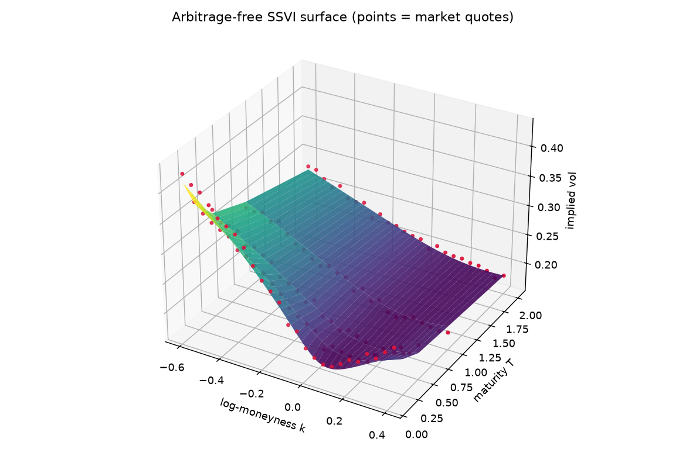
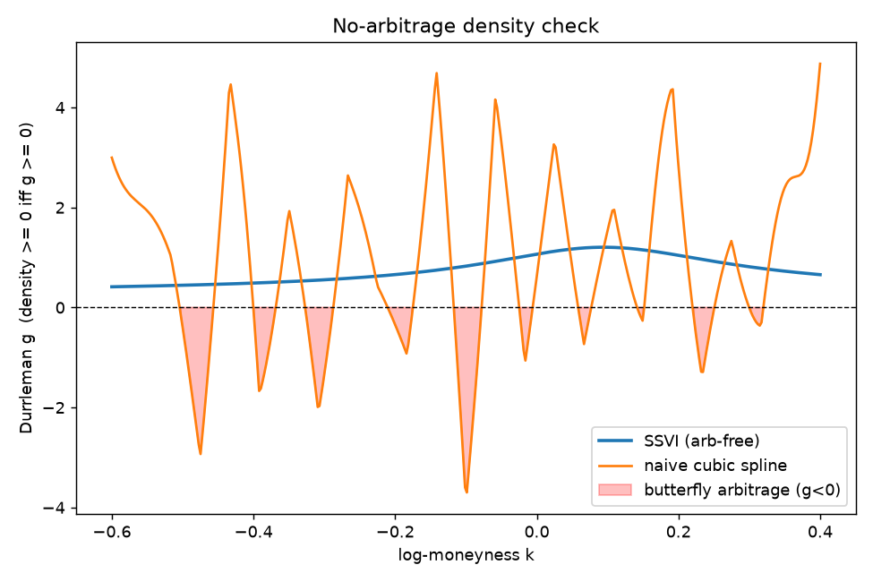
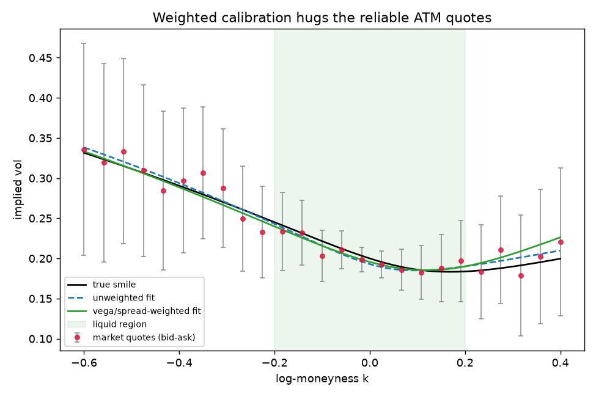
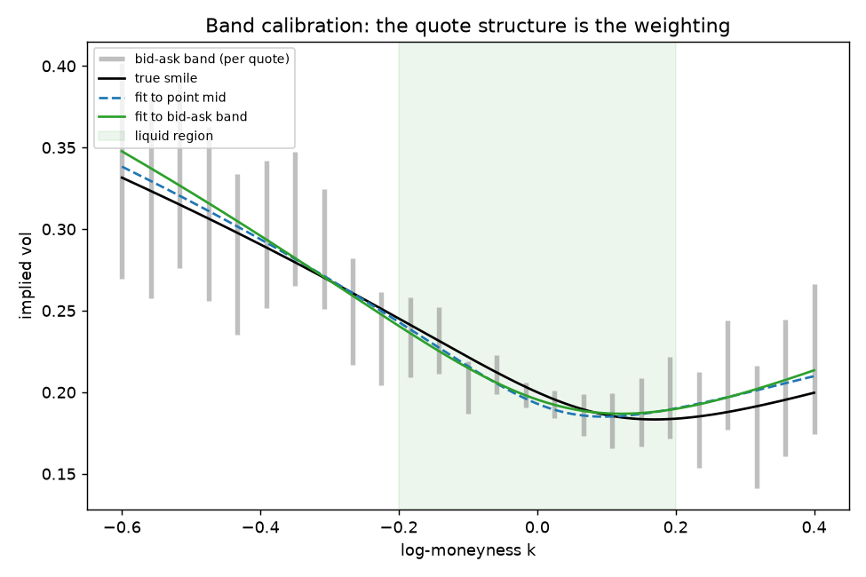

# Arbitrage-free volatility surface (SVI / SSVI)

`vol_surface.py` fits a real, **arbitrage-free** implied-volatility surface and
proves it is arbitrage-free — as opposed to `skew_surface()` in `black.py`, which
just interpolates a single snapshot of market IVs and can imply negative
probabilities or a total variance that falls with maturity.

```bash
python pricing_and_vol_surface/vol_surface.py     # fit, prove, write figures/
python -m pytest tests/test_vol_surface.py -q      # the checks, as tests
```

## What "arbitrage-free" means here

Work in **total implied variance** `w(k) = sigma_BS(k)^2 * T`, where `k` is
log-moneyness. A surface is free of *static* arbitrage when two conditions hold:

* **No butterfly arbitrage** — the implied risk-neutral density is non-negative.
  For a slice this is Durrleman's condition, `g(k) >= 0` for all `k`, where
  `g = (1 - k w'/2w)^2 - (w'/2)^2 (1/w + 1/4) + w''/2`. A negative `g` is a
  negative probability: a butterfly spread with negative cost.
* **No calendar arbitrage** — total variance is non-decreasing in maturity:
  `w(k, T1) <= w(k, T2)` for `T1 < T2`, at every `k`.

These are checked **numerically on a grid**, so the guarantee does not depend on
remembering any parametric constant — it is read straight off the fitted surface.

## The models

* **SVI slice** (Gatheral) — `w(k) = a + b[rho(k-m) + sqrt((k-m)^2 + sigma^2)]`,
  one smile per expiry, with closed-form `w'` and `w''` (so `g(k)` is exact).
* **SSVI surface** (Gatheral-Jacquier 2014) — a global surface tying the slices
  together through the ATM total-variance term structure `theta(T)`:
  `w(k, theta) = (theta/2)[1 + rho*phi*k + sqrt((phi*k + rho)^2 + 1 - rho^2)]`
  with a power-law `phi(theta)`. SSVI is arbitrage-free under explicit
  conditions on `(rho, eta, gamma)`, which the fit enforces via a penalty and
  which are then confirmed numerically.

Surfaces are built from **prices**, not from yfinance's own `impliedVolatility`
field: `iv_from_price()` is a compact Brent inverter (puts mapped to calls by
parity), cross-checked in the tests against the repo's autodiff pricer
`black.py`.

## What the demo shows

`main()` fits to a synthetic surface with known SSVI parameters and noisy quotes,
then reports:

```
per-slice SVI  fit RMSE (total var) = 2.19e-03
global   SSVI  fit RMSE (total var) = 2.68e-03
recovered SSVI: rho=-0.409, eta=0.933, gamma=0.405     (true -0.4, 1.0, 0.4)

No-arbitrage checks on the fitted SSVI surface:
  butterfly: min Durrleman g = +0.3139   -> PASS
  calendar : min d(total var)/dT gap = +0.0052   -> PASS
```



**The failure it prevents.** Interpolating the noisy quotes directly with a cubic
spline — a very common shortcut — chases the quote noise and drives `g(k)`
negative across the smile: a butterfly arbitrage. The fitted SSVI surface removes
it. This is the "where pricing breaks down" story made concrete:



The blue SSVI density proxy stays above zero everywhere; the orange spline dips
into the red arbitrage region repeatedly. `tests/test_vol_surface.py` asserts
both facts — SSVI is arbitrage-free, the naive spline is not — so neither claim
can rot.

## Vega / liquidity-weighted calibration

Real quotes are not equally trustworthy: ATM options are liquid and tightly
quoted, deep wings are illiquid, wide, and noisy. Unweighted least squares treats
them alike, so a few noisy wing quotes can drag the whole fit around.
`fit_svi_slice` / `fit_ssvi` accept `weights`, and `vega_spread_weights()` builds
them as **vega / bid-ask-spread** — an ATM quote is weighted up (high vega, tight
market), a deep-wing quote down (low vega, wide market).

On a slice with noisy, wide-spread wings and tight ATM quotes:

```
ATM total-variance error : unweighted=1.39e-03  weighted=8.61e-04
liquid-region |k|<=0.2   : unweighted=1.02e-03  weighted=9.63e-04
```



Weighting nails the liquid, high-vega region — **where you actually price and
hedge** — by deliberately not chasing the wings. It is an honest trade: the
equal-weighted wing fit gets worse; the numbers that matter get better.
`tests/test_vol_surface.py` asserts the ATM improvement over repeated draws.

## Bid-ask band calibration: the quote structure *is* the weighting

The market does not hand you a price — it hands you an **interval**. Any curve
passing inside `[bid, ask]` is consistent with the quotes, so
`fit_svi_slice_band()` fits to the band itself: the residual is a hinge, zero
anywhere inside the band and the distance to the nearer edge outside it,
**normalised by the band's half-width** — escaping a tight ATM band by a tick
is a large error; missing a wide illiquid wing band by the same tick barely
registers. Inside the band the problem is under-determined, so a small pull
toward the band centre acts as a tiebreak.

This reaches the same destination as vega weighting with no weighting scheme
at all — the quote structure carries the information:

```
ATM total-variance error : mid-fit=1.39e-03  band-fit=8.89e-04
quotes whose band the fit misses: mid-fit=0%  band-fit=0%
```



One subtlety the tests make explicit: quote noise can put a band entirely on
the wrong side of value, so even the **true** smile misses some bands — that
rate is the irreducible floor, and the band fit sits at it rather than at
zero (`test_band_fit_respects_the_quotes`). Averaged over draws the band fit
also beats the mid fit at ATM and across the liquid region, and with the
butterfly penalty on, the band-fitted slice is pushed into the no-arbitrage
region like any other slice (`test_band_fit_can_be_pushed_arbitrage_free`).

## Talking points

* Total-variance space is the right coordinate system: no-arbitrage is a
  statement about `w`, `w'`, `w''`, not about the raw IV plot.
* Butterfly no-arb is a statement about the *density* (Durrleman `g` >= 0);
  calendar no-arb is monotonicity of `w` in `T`. Two different arbitrages, two
  different checks.
* A parametric arbitrage-free form (SSVI) buys you a surface you can interpolate
  and extrapolate safely; a spline through quotes does not.

## Limitations and next steps

* SSVI is a *global* two-and-a-half parameter form; it cannot fit every smile
  exactly. Per-slice SVI is more flexible but must be checked (and, if needed,
  constrained) slice by slice — both are provided.
* No smoothing of the ATM term structure `theta(T)`; it is read from the quotes.
* Calibration supports vega/liquidity weighting and bid-ask band fitting
  (above) per slice; wiring the band residual into the *global* SSVI fit is
  the natural next step.
